# Biobyte Sistemas - Desafio Processo Seletivo
### _Samuel Luiz da Cunha Viana Cruz_
---

### <ins>Programação Web - Questão 1</ins>
#### Acesso para a resolução: [Questão 1](web-questao1/questao1.json)
 
A representação em JSON do auto de infração contém todos os campos necessários conforme especificado no enunciado:
- `"id"`: Código de identificação do auto de infração;
- `"violation_type_id"`: Código referente ao tipo de autuação aplicada;
- `"officer_observation"`: Observação feita pelo agente que emitiu o auto;
- `"date_time_ticket"`: Data e hora em que o auto foi emitido;
- `"location"`: Endereço da ocorrência, contendo o nome do município, nome do logradouro e numeração;
- `"vehicle_info"`: Dados do veículo autuado, incluindo marca, modelo e placa.
  
 

---
### <ins>Programação Web - Questão 2</ins>
#### Acesso para a resolução: [Questão 2 (site)](https://vianasamuel.github.io/Biobyte-Desafios/web-questao2/index.html) e [Questão 2 (repositório)](web-questao2)

#### Print do site:   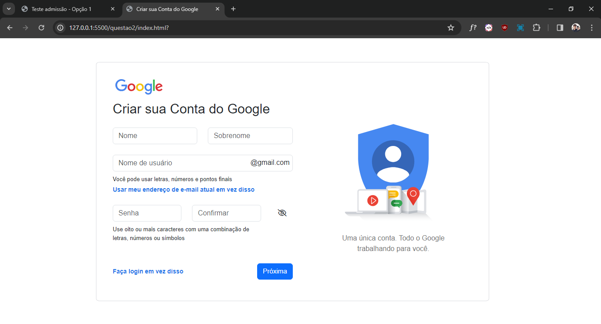

#### <ins>Pontos a destacar:</ins>
- O site conta com responsividade:   
  
 

- O input do e-mail não ultrapassa a *label* *"@gmail.com"*:   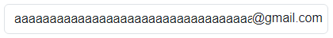

 

- Não é possível selecionar/arrastar as imagens ou a *label* *"@gmail.com"*.

 

---
### <ins>Programação Web - Questão 3</ins>
#### Acesso para a resolução: [Questão 3 (site)](https://vianasamuel.github.io/Biobyte-Desafios/web-questao3/index.html) e [Questão 3 (repositório)](web-questao3)

#### Print de uma validação incorreta:   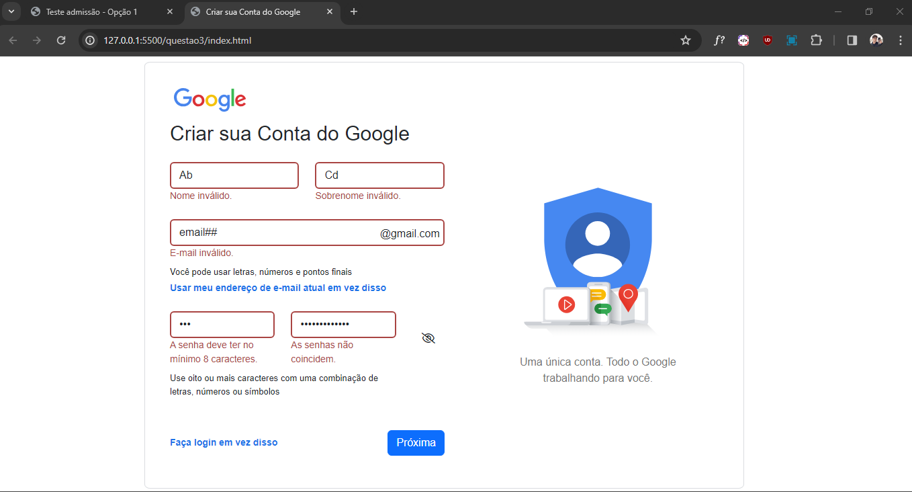

#### Print de uma validação correta:   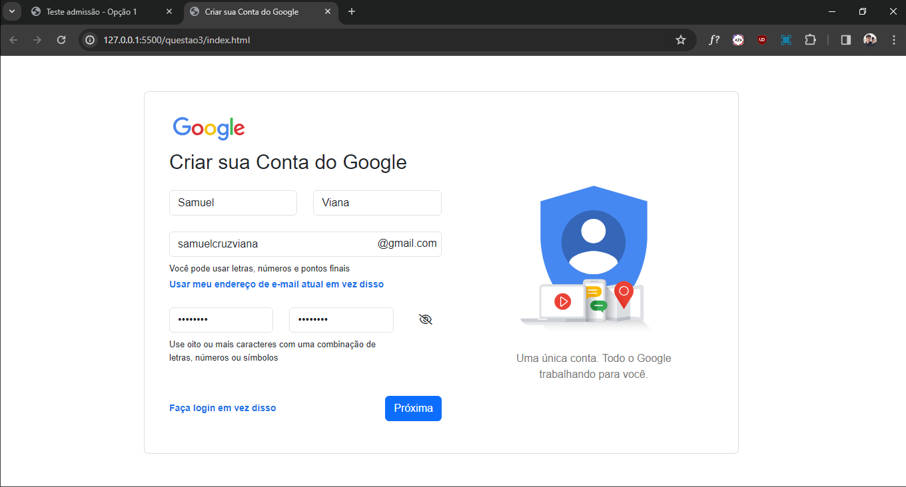

#### <ins>Pontos a destacar:</ins>
- **Validação de <ins>Nome e Sobrenome</ins>:** RegEx + Mínimo de 3 dígitos;

 

- **Validação de <ins>E-mail</ins>:** RegEx + Mínimo de 3 dígitos + Aceita pontos finais (.) e hífens (-):   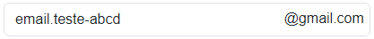

 

- **Validação de <ins>Senha</ins>:** Mínimo de 8 dígitos + Validação da confirmação.

 

---
### <ins>Programação Web - Questão 4</ins>
#### Acesso para a resolução: [Questão 4 (site)](https://vianasamuel.github.io/Biobyte-Desafios/web-questao4/public/index.html) e [Questão 4 (repositório)](web-questao4)

O back-end REST do site foi criado utilizando NodeJS e ExpressJS, sendo o end-point configurado em *"/conta/cadastrar"*.

Etapas seguidas para implementar o back-end REST:
1. **Configuração** do ambiente (instalação de dependências, como o ExpressJS);
2. **Definição** das configurações do servidor e da porta de escuta;
3. **Configuração** dos middlewares para tratamento de requisições, parsing de JSON e servir arquivos estáticos;
4. **Definição** das rotas das requisições e processamento do cadastro de contas em *"/conta/cadastrar"*;
5. **Implementação** simplificada, conforme o enunciado, da ação da rota (confirmação com status 201);
6. **Inicialização** do servidor para escutar requisições.

#### Print dos inputs de exemplo:   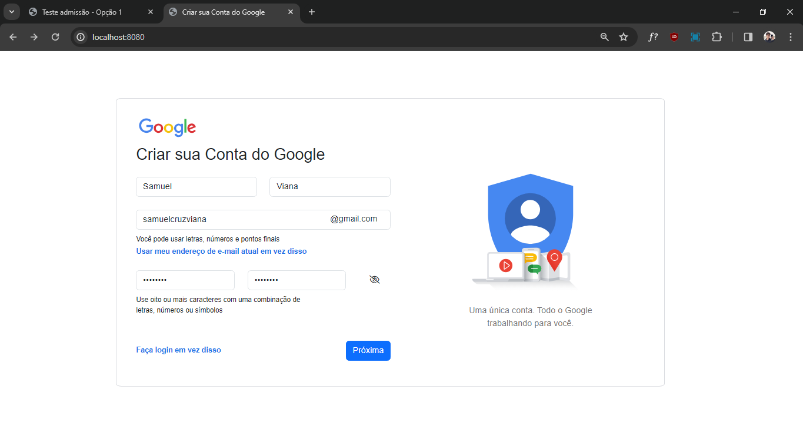
#### Print da resposta do servidor (end-point connfigurado em */conta/cadastrar*):   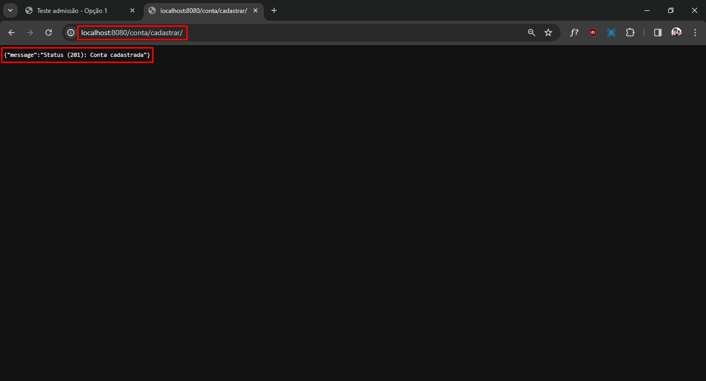
#### Print dos dados cadastrados recebidos:   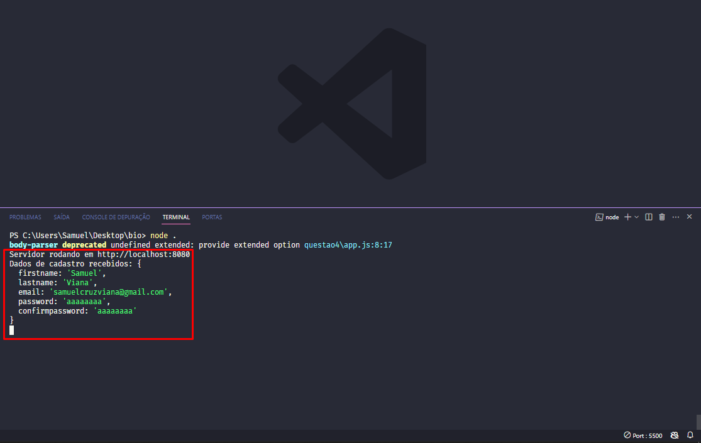

 

---
### <ins>Teste de R - Questão 1</ins>
#### Acesso para a resolução: [Questão 1](r-questao1)

A importação da base de dados IRIS, conforme especificado no enunciado, foi baixado localmente através do link [https://archive.ics.uci.edu/dataset/53/iris](https://archive.ics.uci.edu/dataset/53/iris).

A importação dos dados foi realizada em 4 etapas:
1. **Leitura dos dados:** O arquivo *iris.data* é importado;
2. **Definição dos atributos:** Os atributos foram associados a todos os registros, uma vez que o arquivo não possui cabeçalho;
3. **Estruturação dos dados:** Os dados foram preparados para análise e visualização.;
4. **Visualização dos dados**.

#### Print do console:   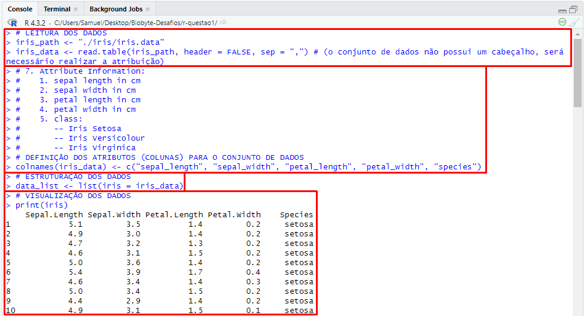

#### Print dos dados do ambiente:   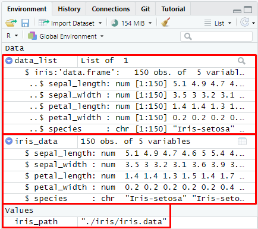

#### Print da tabela:   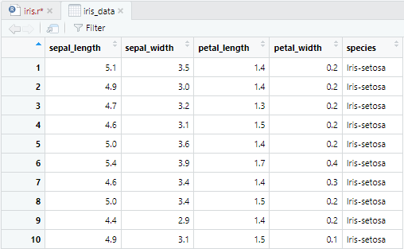

 

---
### <ins>Teste de R - Questão 2</ins>
#### Acesso para a resolução: [Questão 2](r-questao2)

Conforme o enunciado, a análise da base de dados foi realizada identificando:
1. **Quantidade** de atributos e registros;
2. **Tipos** de atributos;
3. **Sumário** da base;
4. **Transformação** de *Species* em *Factor*;
5. **Quantidade** de registros por espécie.

#### Print do resultado da análise no console:   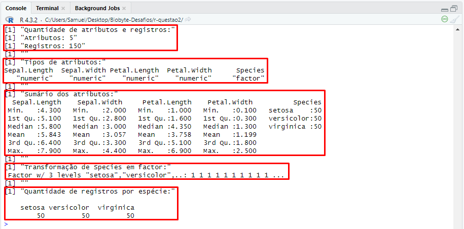

#### Print do código:   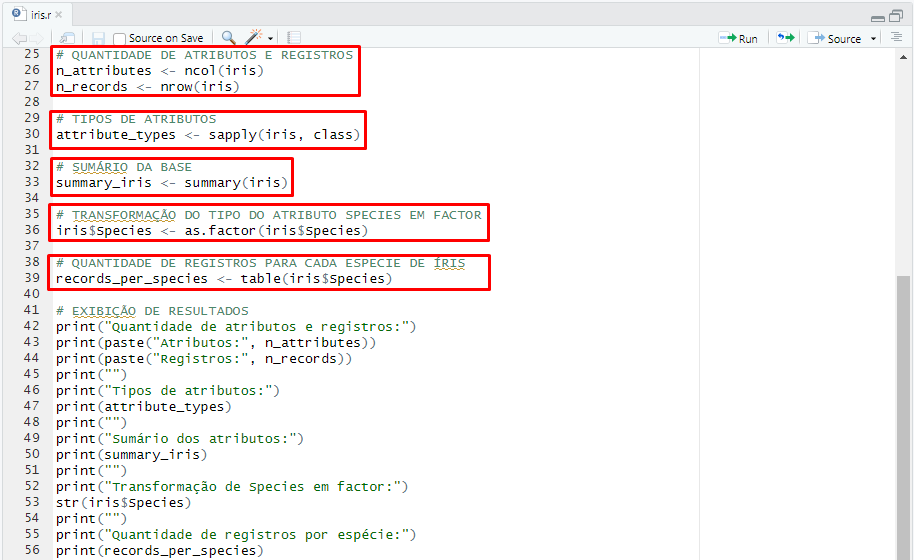

 

---
### <ins>Teste de R - Questão 3</ins>
#### Acesso para a resolução: [Questão 3](r-questao3)

As etapas seguidas para adicionar o novo registro ao dataframe foram:
1. **Cálculo dos valores médios dos atributos**, excluindo o atributo das espécies;
2. **Criação do novo registro**, adicionando o valor "NA" para o atributo das espécies;
3. **Adição do novo registro ao dataframe**;
4. **Visualização do novo registro**.

#### Print do console:   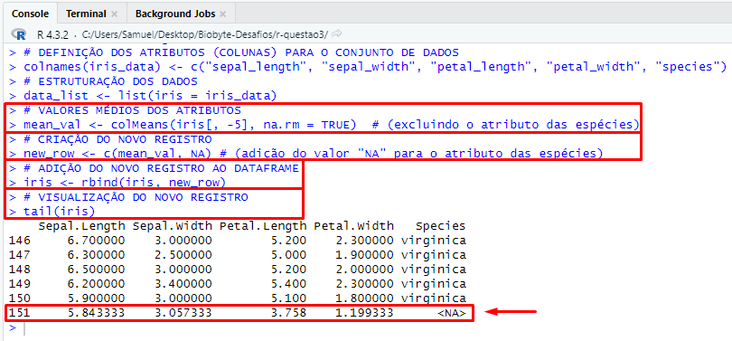

#### Print do novo registro na tabela:   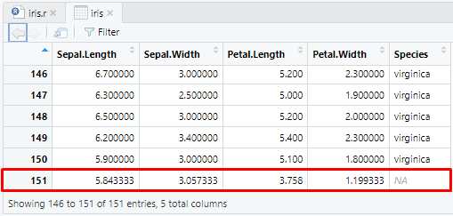

 

---
### <ins>Teste de R - Questão 4</ins>
#### Acesso para a resolução: [Questão 4](r-questao4)

Foi utilizada a função `ifelse` para atribuir valores numéricos às espécies, conforme especificado:
- **1** para Setosa;
- **2** para Versicolor;
- **3** para Virginica;
- **NA** para outros casos.

#### Print do código:   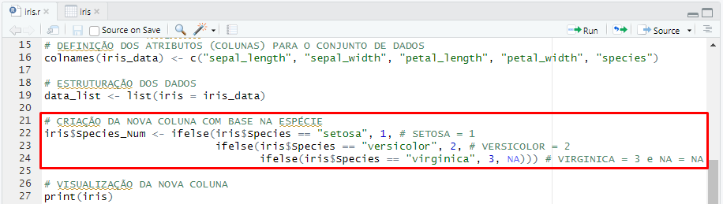

#### Print da Setosa na tabela:   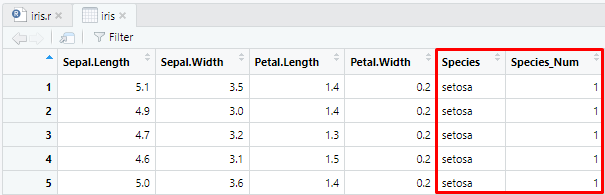

#### Print da Versicolor na tabela:   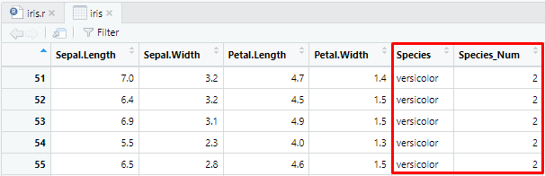

#### Print da Virginica na tabela:   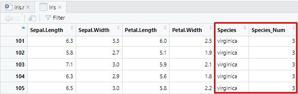

 

---
### <ins>Teste de R - Questão 5</ins>
#### Acesso para a resolução: [Questão 5](r-questao5)

Etapas seguidas para a criação do gráfico de barras:
1. **Contagem** dos registros por espécie;
2. **Definição** das cores para cada espécie;
3. **Criação** do gráfico de barras, especificando título, rótulos dos eixos, limites do eixo y e cores das barras.
4. **Adição** da legenda na parte superior central do gráfico, especificando a orientação horizontal e as cores correspondentes.

#### Resultado (exportado) do gráfico de barras:   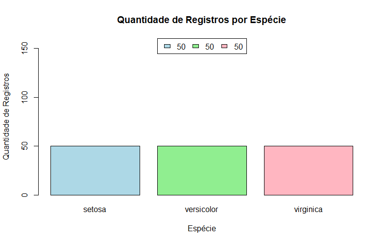

#### Print do código:   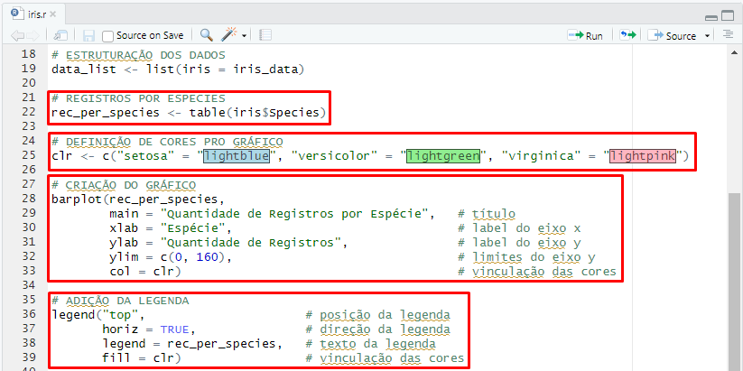

 

---
### <ins>Teste de R - Questão 6</ins>
#### Acesso para a resolução: [Questão 6](r-questao6)

Etapas seguidas para a criação do gráfico de pizza:
1. **Contagem** dos registros por espécie;
2. **Criação** do gráfico de pizza, especificando título, tamanho da fonte, rótulos e cores das fatias.
3. **Adição** da legenda na parte inferior esquerda do gráfico, especificando a orientação horizontal, título e cores correspondentes.

#### Resultado (exportado) do gráfico de pizza:   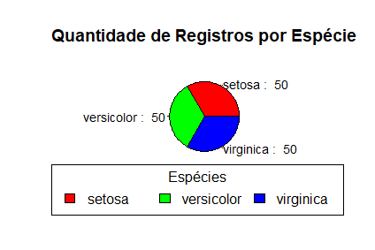

#### Print do código:   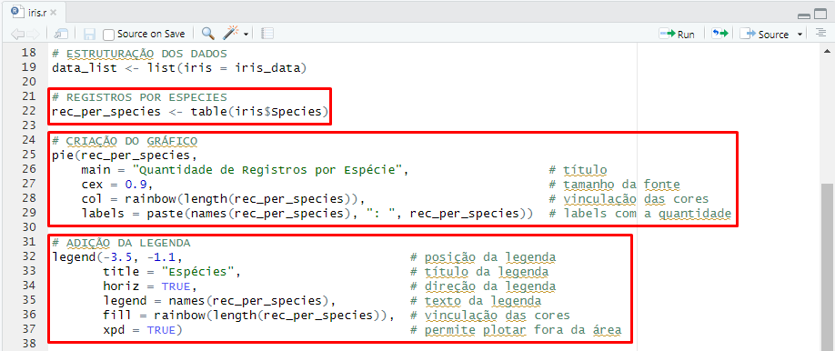