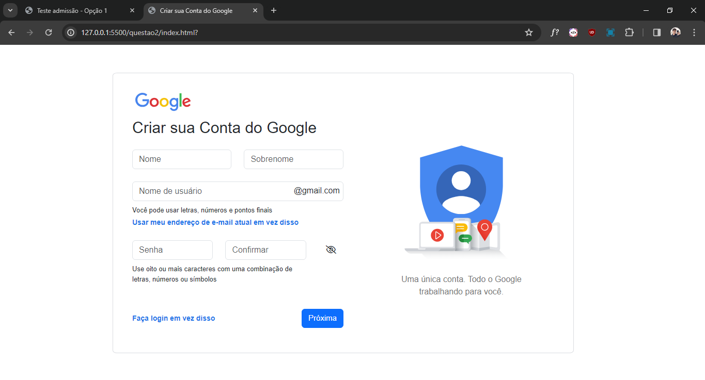
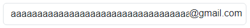
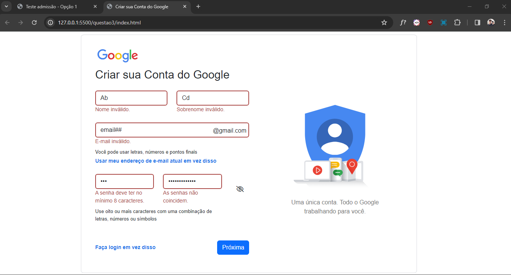
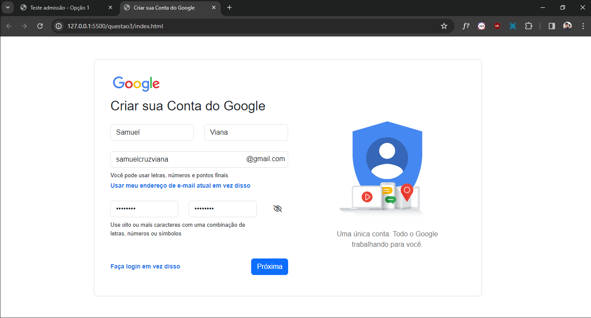
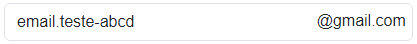
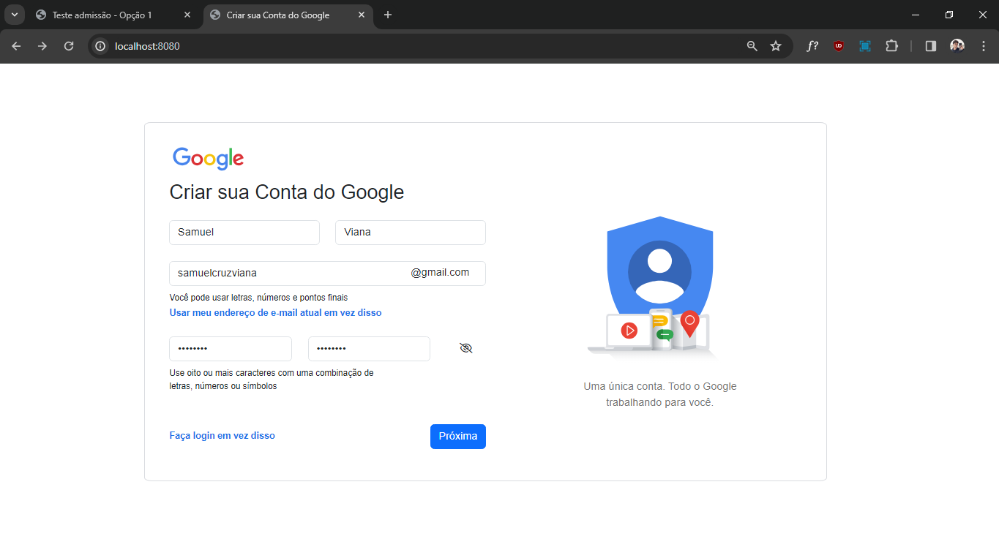
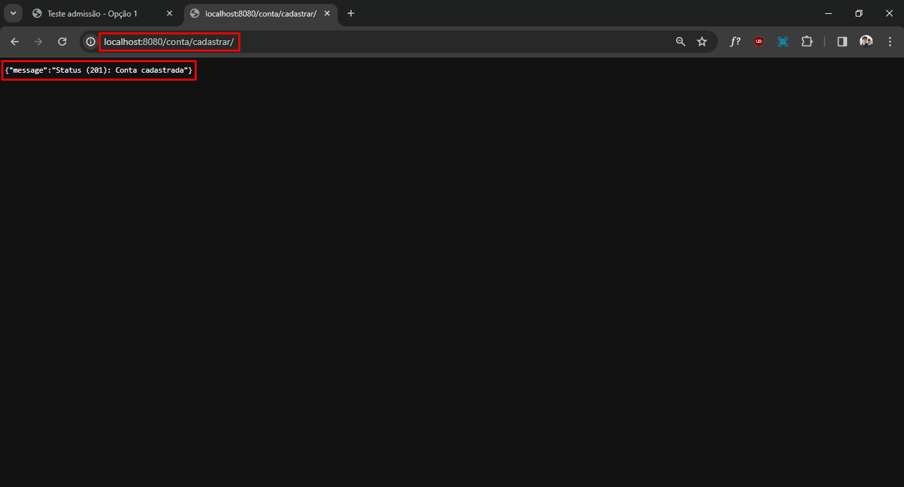
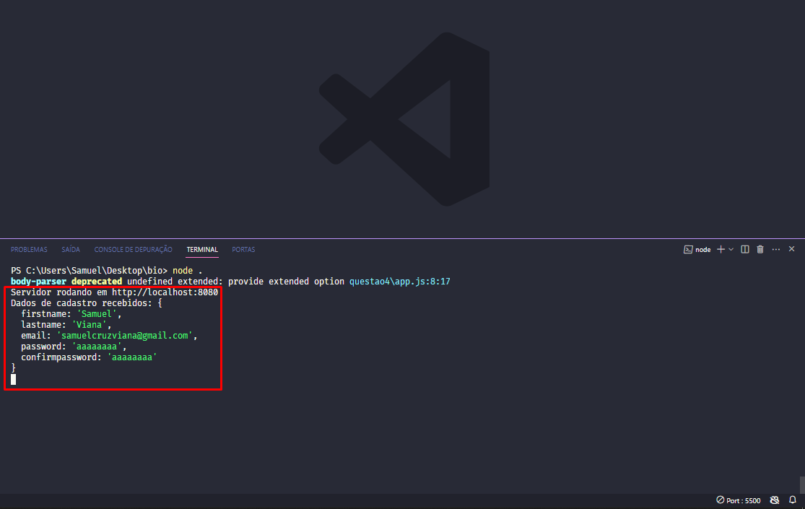

# Biobyte Sistemas - Desafio Processo Seletivo
### _Samuel Luiz da Cunha Viana Cruz_

 

---
## Questão 1
### Acesso para a resolução: [Questão 1](questao1/questao1.json)
 
A representação em JSON do auto de infração contém todos os campos necessários conforme especificado no enunciado:
- `"id"`: Código de identificação do auto de infração;
- `"violation_type_id"`: Código referente ao tipo de autuação aplicada;
- `"officer_observation"`: Observação feita pelo agente que emitiu o auto;
- `"date_time_ticket"`: Data e hora em que o auto foi emitido;
- `"location"`: Endereço da ocorrência, contendo o nome do município, nome do logradouro e numeração;
- `"vehicle_info"`: Dados do veículo autuado, incluindo marca, modelo e placa.
  
 

---
## Questão 2
### Acesso para a resolução: [Questão 2](questao2)

### Print do site: 

### Pontos a destacar:
- O site conta com responsividade:   
  
 

- O input do e-mail não ultrapassa a *label* *"@gmail.com"*:   

 

- Não é possível selecionar/arrastar as imagens ou a *label* *"@gmail.com"*.

 

---
## Questão 3
### Acesso para a resolução: [Questão 3](questao3)

### Print de uma validação incorreta: 

### Print de uma validação correta: 

### Pontos a destacar:
- **Validação de <ins>Nome e Sobrenome</ins>:** RegEx + Mínimo de 3 dígitos;

 

- **Validação de <ins>E-mail</ins>:** RegEx + Mínimo de 3 dígitos + Aceita pontos finais (.) e hífens (-):   

 

- **Validação de <ins>Senha</ins>:** Mínimo de 8 dígitos + Validação da confirmação.

 

---
## Questão 4
### Acesso para a resolução: [Questão 4](questao4)

### Print dos inputs de exemplo: 
### Print da resposta: 
### Print dos dados cadastrados: 